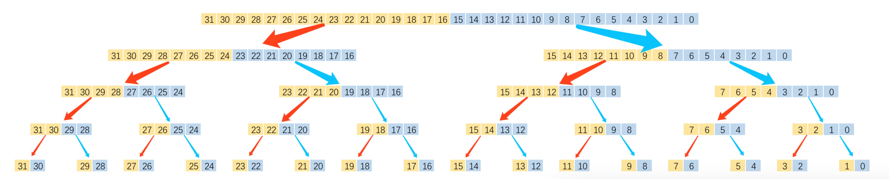

### JDK Integer.bitCount源码解析

#### 功能说明：
    给定任意一个整数（int型），不论正负，给出其二进制表示法中位的值为1的位的个数
    例如：
                 1 => 00000000 00000000 00000000 00000001，值为1
        0x55555555 => 01010101 01010101 01010101 01010101，值为16
                -1 => 11111111 11111111 11111111 11111111，值为32
                
#### 源码:
```java
    public static int bitCount(int i) {
        // HD, Figure 5-2
        i = i - ((i >>> 1) & 0x55555555);
        i = (i & 0x33333333) + ((i >>> 2) & 0x33333333);
        i = (i + (i >>> 4)) & 0x0f0f0f0f;
        i = i + (i >>> 8);
        i = i + (i >>> 16);
        return i & 0x3f;
    }
```
*基于：java version "1.8.0_181"*

#### 解析：

**算法猜测：分治法**


&emsp;Java的int类型表示为2进制共32位。

&emsp;如上图所示：

&emsp;求解32位中1的个数，等价于求它的高16位中1的个数加上它的低16位中1的个数。

&emsp;而求解16位中1的个数，等价于求解它的高8位中1的个数加上它的低8位中1的个数。

&emsp;依此类推，可将问题不断分解，直到问题分解成：求一个2位中1的个数，等价于求解其高1位中1的个数加上低1位中1的个数。

&emsp;当问题分解到最小单元，即1位的时候，问题的解便是显而易见的：数字是1，就是1个，数字是0，就是0个。

&emsp;算法的推导过程往往是将问题"大事化小，小事化了"，反映到到具体的代码上通常是从小问题解起，逐步汇总问题的结果，直到得到最大问题的解。

&emsp;下面我们来具体解析源代码：

&emsp;首先代码中用到了几个"机巧"：
* 一是原址性，即利用输入的数字本身进行问题的求解，在空间上并没有把问题分解到不同的空间中，怎么理解这句话？
假如非原址性的话，我们可以再声明两个整数，比如：`int left = 0;int right = 0;`然后把分解后整数的高位部分存储到`left`中，低位部分存储到`right`中，
因为请求了新的空间，所以就不叫原址性。
* 二是使用了大量位运算，加快算法的运行速度。因为CPU最底层的运算方式就是位运算，所以计算速度极快。

**源码解析:**
```java
    public static int bitCount(int i) {
        //第一行对应原理图的最后一步，即求解问题规模为2位时1的个数，具体解析如下：
        //我们先解析(i >>> 1) & 0x55555555这一部分：
        //注意：我们现在所要求解的问题规模是2，也就是说总共的情况不外乎以下4种，即：
        //00、01、10、11
        //现在再来看上面的公式会简单很多
        //4种情况对应的 i>>>1 的结果分别为x0、x0、x1、x1，其中x是右移过来的更高位
        //如果是非原址性的算法，x肯定是0，但因为我们使用的是原址性的算法，所以可能是1，也可能是0，但其实这并不影响我们的计算，因为下一步便做了屏蔽操作
        //当 i>>>1 的结果与0x55555555(即01010101010101010101010101010101)进行与运算后，不论x的值是什么，结果都将为0
        //即00、01、10、11通过公式 (i >>> 1) & 0x55555555 的计算结果为00、00、01、01
        //第一行整体公式：i - ((i >>> 1) & 0x55555555)的结果就是：
        //00 - 00 = 00(0个1)
        //01 - 00 = 01(1个1)
        //10 - 01 = 01(1个1)
        //11 - 01 = 10(2个1)
        //减号左边表示原始的i值，减号右边表示 (i >>> 1) & 0x55555555 的值，等号右边是最后运算结果
        //第一行最终的运行结果是将"每2位中数字1的个数的二进制表示的值恰好填充回原位置"
        //其实，第一行如果写成 (i & 0x55555555) + ((i >>> 1) & 0x55555555)可能更好理解，也与之后的代码形成更好的类比
        i = i - ((i >>> 1) & 0x55555555);
        //第二行对应原理图中的倒数第二步
        //执行了第一步的运算之后，"原本的数字i已经不再是数字i"，对于我们的算法而言，每两位一组才有意义(表示这两位中数字1的个数)
        //连贯的32位数字本身的对我们的算法来说是没有任何意义的，我们可以认为，我们只是把16个表示"2位问题"有多少个1的解的数字，存在了一个32位的数字中而已
        //0x33333333表示为2进制是：00110011 00110011 00110011 00110011
        //(i & 0x33333333) 屏蔽了"4位问题"中的高2位
        //((i >>> 2) & 0x33333333) 先右移两位，继而屏蔽了右移之后数值中的高2位
        //以上(指注释中)的两步操作，等于将原本存在"32位数字"中的"2位问题"的解移到同一位置进行求和
        //比如代码第一行求解后的一个"4位问题"是：0101，经过前两步(还是指注释)操作后，等价于 01 + 01 = 10，新的10将存储到"32位数字"中对应的位置
        i = (i & 0x33333333) + ((i >>> 2) & 0x33333333);
        //以下三行代码原理同上
        //其中 &0x0f0f0f0f，表示为二进制等于：00001111000011110000111100001111，因为"8位"问题解中最大解也就是8(即8个1)，而1111可表示的最大值是15，所以可以省略前4位
        i = (i + (i >>> 4)) & 0x0f0f0f0f;
        i = i + (i >>> 8);
        i = i + (i >>> 16);
        //因为"32位问题"的最大解只有32(即32个1)，0x3f转换为二进制等于：00000000000000000000000000111111，低6位足够表示数字32，所以可以与运算，舍弃高26位
        return i & 0x3f;
    }
```

>努力讲大白话，如果一遍看不懂，说明讲的不透，欢迎留言
